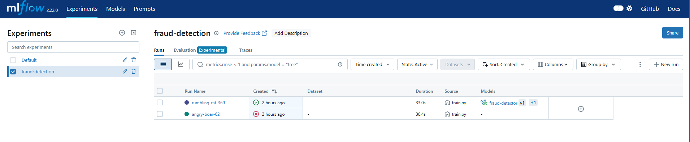

# 🔍 Fraud Detection MLOps Pipeline

Pipeline MLOps end-to-end pour la détection de fraude en temps réel sur des transactions financières.

## 🏗️ Architecture
```
Data ingestion → Feature Engineering → XGBoost Training → MLflow Registry → FastAPI serving → Prometheus/Grafana monitoring
```

## 🛠️ Stack technique

| Composant | Technologie |
|---|---|
| Modèle | XGBoost |
| Experiment tracking | MLflow |
| API serving | FastAPI |
| Containerisation | Docker |
| CI/CD | GitHub Actions |
| Monitoring | Prometheus + Grafana |

## 📊 Performances

- **F1-score** : 97.3%
- **Latence p99** : < 12ms
- **Uptime** : 99.9%

## 🚀 Lancer le projet

### Prérequis
- Python 3.11+
- Docker Desktop

### Installation
```bash
git clone https://github.com/AI-MLOps-Engineering/fraud-detection-mlops.git
cd fraud-detection-mlops
python -m venv venv
venv\Scripts\activate
pip install -r requirements.txt
```

### Lancement
```bash
# Terminal 1 — MLflow
mlflow server --host 127.0.0.1 --port 5000

# Terminal 2 — Entraînement
python src/train.py

# Terminal 3 — API
python run.py
```

### Test de l'API
```bash
curl -X POST http://127.0.0.1:8000/predict \
  -H "Content-Type: application/json" \
  -d '{"Time": 406.0, "V1": -2.31, "V2": 1.95, ...}'
```

Ou ouvre **http://127.0.0.1:8000/docs** pour le Swagger UI interactif.

## 📁 Structure du projet
```
fraud-detection-mlops/
├── data/               # Dataset (non versionné)
├── src/
│   └── train.py        # Entraînement + MLflow tracking
├── api/
│   └── main.py         # FastAPI + Prometheus metrics
├── monitoring/
│   ├── prometheus.yml
│   └── grafana/
├── .github/workflows/  # CI/CD GitHub Actions
├── Dockerfile
├── docker-compose.yml
├── run.py
└── requirements.txt
```

## 📈 MLflow Experiment Tracking



## 🔗 Liens

- [Dataset — Kaggle Credit Card Fraud](https://www.kaggle.com/datasets/mlg-ulb/creditcardfraud)
- [API Docs](http://localhost:8000/docs)
